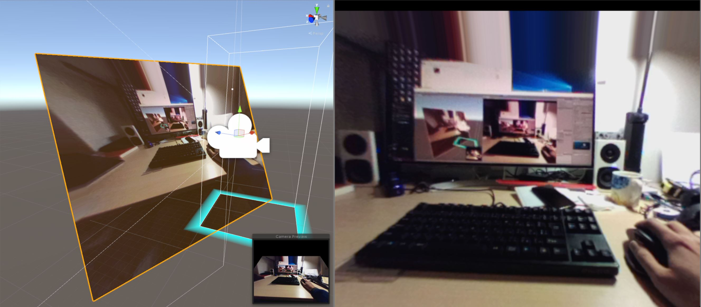
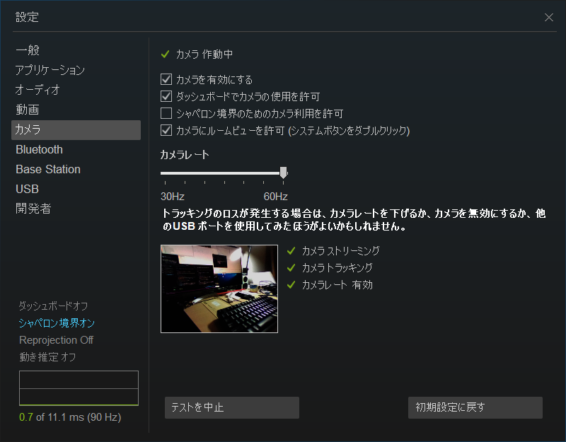
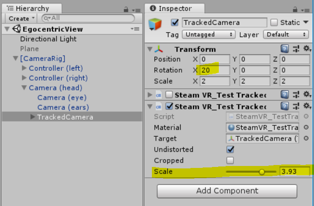

## VIVE CAMERA UTILIZE FOR EGOCENTRIC VIEW

### 何

VIVE のフロントカメラ映像を、主観視点から見えている風に描画する。ARとかMRとかに使える、と思う。

基本的には SteamVR Unity Plugin の `SteamVR/Extas/SteamVR_TestTrackedCamera.unity` と言うサンプルをベースにして、もう少々ちゃんと主観視点っぽく見えるよう調整項目を増やしました。

### 環境

* Unity 2018.1.6f1（たぶん異なるバージョンでも問題無い）
* VIVE（無印）
* [SteamVR Unity Plugin v1.2.3](https://github.com/ValveSoftware/steamvr_unity_plugin/releases/tag/1.2.3)
  * SteamVR Unity Plugin 2 以降はこのプロジェクトではサポートしません。

### ビルド・実行

* このリポジトリを落としてくる
* [SteamVR Unity Plugin v1.2.3](https://github.com/ValveSoftware/steamvr_unity_plugin/releases/tag/1.2.3) を落としてくる
* `Assets/Scenes/SampleScene.unity` シーンを開く。**（絶対に `EgocentricView.unity` はひらかないこと！）**
* SteamVR Unity Plugin の .unitypackage を展開
* それから、`EgocentricView.unity` を開いて
* VIVE がつながっていることと、SteamVRの設定からカメラ利用を許可していることを確認（下図）してから
* 実行

#### 注意点

先に SteamVR Unity Plugin を展開しないと、`EgocentricView.unity` シーンから見てアセットが全然無い状態になるので、シーンが壊れます。この場合は、**絶対に保存せずに**、SteamVR Unity Plugin の展開を済ませ、一度Unityを落として、再度`EgocentricView.unity`を開き直してください。

### ちょっとだけコードの説明

SteamVR Unity Plugin の `SteamVR/Extas/SteamVR_TestTrackedCamera.unity` と言うサンプルをベースにしています。コードも、サンプルに含まれている `SteamVR/Extas/SteamVR_TestTrackedCamera.cs` をコピーして `Scripts/SteamVR_TestTrackedCameraMy.cs` とし、少し調整項目を加えました。

#### カメラ映像の変形に関して

カメラ映像をVIVEでみたときに正しく見えるよう歪ませるのは、SteamVR Unity Plugin で `SteamVR_TrackedCamera.Source(true).texture` のように用意されています。 基本はこれを使うだけ。

### 調整項目

配布時の値は適当に合わせてみた物ですが、気になったら調整してみてください。下図の2つの変数を動かすと、向きと大きさが微調整されます。

* TrackedCamera オブジェクトの Roation X：VIVE はカメラがZ方向真正面ではなく、やや下向きについているし、人によってかけ方が異なるのでそれを調整する。
* `SteamVR_TestTrackedCameraMy` の `Scale`：表示の大きさ。

